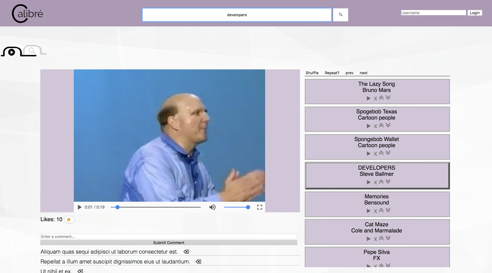
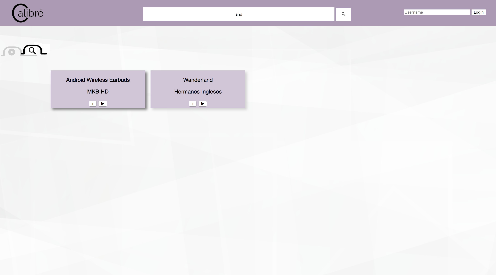

# Calibre
Calibre is a web application that allows users to search, play, and save music and videos to a playlist.

[Click here to view the backend of Calibre](https://github.com/MarvinClerge/Calibre-Backend)

## Motivation
The goal behind this application was to refine my web development skills in the following areas:
* Vanilla Javascript to create a single page application
* Ruby on Rails API backend with a PostgreSQL database to utilize AJAX
* CSS Grid and Flexbox to create responsive application.
* Git proficiency and project management working in a group of 3
* Understanding HTML video and audio tags

## Tech/framework used
#### PostgreSQL
Used to store and manage user information.
#### Ruby on Rails
Used to create backend JSON API.
#### Javascript
Used to create frontend, DOM manipulation, user interface, and fetching data from backend API.

## Installation
In order to use this application ruby must be installed
### MAC OS
1. Download both the frontend and backend of Calibre
2. Go to the backend folder location in your terminal and run `bundle install`
3. After the installation is complete run `rails db:migrate` and `rails db:seed` to create the database
4. Run `rails s` to start the backend rails server
5. Go to the frontend folder location in your terminal
6. Open `index.html` in your browser

## How to use?
After installation this application offers a variety of activities. Below are the myriad of things you can do:

#### Searching
In the center of the navbar, there will be a large search bar. A user can use this to search for videos and music by title. A new page with then render containing the user’s search results.
#### Login
In the top right of the navbar the user will find the login input. This site only needs a username to login. After typing the username the user’s previously saved playlist will be loaded. Once logged in a user any modifications to the user’s playlist will now be automatically saved.
#### Switching Sections
Under the navbar, there will be two tab buttons that allows the user to switch between the playing content and the browsing content.
#### Playlist
When a user is playing media content they can manage their playlist on the right side of the screen. A user can play, shuffle, repeat, remove, change order, play previous and play next on all media content within their playlist.
#### Likes & Comments
If a user is logged in they can like a media item by clicking the fire button, and/or comment on media item.
#### Browsing and Suggestions
On each media item card a user can click play to view the media content. If the user clicks the + button it will be added to their playlist. The user can only add the media item to their playlist once.

## Screenshots

## License
MIT License

Copyright (c) 2018 Marvin Clerge

Permission is hereby granted, free of charge, to any person obtaining a copy
of this software and associated documentation files (the "Software"), to deal
in the Software without restriction, including without limitation the rights
to use, copy, modify, merge, publish, distribute, sublicense, and/or sell
copies of the Software, and to permit persons to whom the Software is
furnished to do so, subject to the following conditions:

The above copyright notice and this permission notice shall be included in all
copies or substantial portions of the Software.

THE SOFTWARE IS PROVIDED "AS IS", WITHOUT WARRANTY OF ANY KIND, EXPRESS OR
IMPLIED, INCLUDING BUT NOT LIMITED TO THE WARRANTIES OF MERCHANTABILITY,
FITNESS FOR A PARTICULAR PURPOSE AND NONINFRINGEMENT. IN NO EVENT SHALL THE
AUTHORS OR COPYRIGHT HOLDERS BE LIABLE FOR ANY CLAIM, DAMAGES OR OTHER
LIABILITY, WHETHER IN AN ACTION OF CONTRACT, TORT OR OTHERWISE, ARISING FROM,
OUT OF OR IN CONNECTION WITH THE SOFTWARE OR THE USE OR OTHER DEALINGS IN THE
SOFTWARE.
